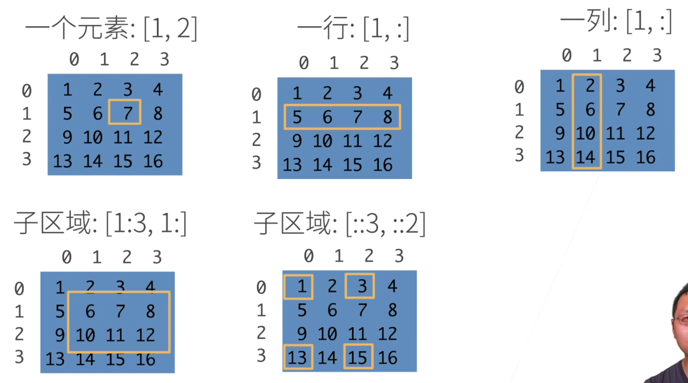

# 深度学习笔记

## 1 基础数据操作

访问元素时，有如下操作（一列：`[:,1]`）：



## 2 PyTorch 数据操作

### `torch.utils.data.TensorDataset`

一个非常实用的数据集封装类，用于将多个张量组合成一个统一的数据集接口

```python
from torch.utils.data import TensorDataset
import torch

# 创建示例数据
features = torch.randn(100, 5)  # 100个样本，5个特征
labels = torch.randint(0, 2, (100,))  # 100个标签

# 创建 TensorDataset
dataset = TensorDataset(features, labels)
```

### `torch.randn()`

用于生成服从标准正态分布的随机数张量，定义如下：

```python
torch.randn(*size, *, out=None, dtype=None, layout=torch.strided, 
           device=None, requires_grad=False) → Tensor

# 生成标量（0维张量）
x = torch.randn(())
print(x)  # 例如: tensor(0.1234)

# 生成1维张量（向量）
x = torch.randn(5)
print(x)  # 例如: tensor([-0.2345, 1.5678, 0.8765, -1.2345, 0.5432])

# 生成2维张量（矩阵）
x = torch.randn(3, 4)
print(x)
```

### `torch.randint()`

用于生成在指定范围内均匀分布的随机整数的函数，定义如下：

```python
torch.randint(low=0, high, size, *, generator=None, out=None, dtype=None, layout=torch.strided, device=None, requires_grad=False) → Tensor
```

- **`low` (int, optional)**: 产生随机整数范围的**下限**（包含）。默认值是 `0`。
- **`high` (int)**: 产生随机整数范围的**上限**（**不包含**）。这是一个必须指定的参数。
- **`size` (tuple of ints)**: 定义了输出张量的**形状**。例如，`size=(2, 3)` 会生成一个 2行3列 的矩阵；`size=(5,)` 会生成一个长度为5的向量。

### `torch.utils.data.DataLoader`

负责高效地加载和预处理数据，并将其组织成批次供模型训练使用。

```python
DataLoader(
    dataset,            # 必须：Dataset对象
    batch_size=1,       # 批次大小
    shuffle=False,      # 是否打乱数据（训练集通常为True，测试集为False）
    num_workers=0,      # 加载数据的进程数（0=主进程，建议设为CPU核心数）
    pin_memory=False,   # 是否锁页内存，GPU训练时建议为True
    drop_last=False,    # 是否丢弃最后一个不完整的批次
)

import torch
from torch.utils.data import DataLoader, TensorDataset

# 1. 准备数据（这里用虚拟数据示例）
x = torch.randn(100, 3, 32, 32)  # 100个样本，3通道，32x32图像
y = torch.randint(0, 10, (100,))  # 100个标签

# 2. 创建 Dataset（这里使用TensorDataset）
dataset = TensorDataset(x, y)

# 3. 创建 DataLoader
dataloader = DataLoader(
    dataset=dataset,
    batch_size=32,      # 每个批次的样本数
    shuffle=True,       # 是否打乱数据
    num_workers=2       # 使用几个进程加载数据
)

# 4. 在训练循环中使用
for epoch in range(3):
    for batch_idx, (data, target) in enumerate(dataloader):
        # data.shape: torch.Size([32, 3, 32, 32])
        # target.shape: torch.Size([32])
        print(f'Epoch: {epoch}, Batch: {batch_idx}, Data shape: {data.shape}')
        
        # 这里通常是训练代码：
        # optimizer.zero_grad()
        # output = model(data)
        # loss = criterion(output, target)
        # loss.backward()
        # optimizer.step()
```

## 3 torch.nn

### `torch.nn.Linear`

#### 1. 它是什么？

`nn.Linear` 是 PyTorch 的 `torch.nn` 模块中的一个类，它用于定义一个**全连接层**（Fully Connected Layer），也叫**线性层**或**仿射变换层**。

它的核心作用就是执行一个**线性变换**：

```
输出 = 输入 · 权重^T + 偏置
```

- `权重^T` 表示权重的转置。这是为了满足矩阵乘法的维度要求。
- 如果设置了 `bias=False`，则没有 `+ 偏置` 这一步。

#### 2. 语法和参数

python

```python
torch.nn.Linear(in_features, out_features, bias=True)
```

- **`in_features`**： 每个输入样本的特征数量（即输入张量最后一个维度的大小）。
- **`out_features`**： 每个输出样本的特征数量（即输出张量最后一个维度的大小）。
- **`bias`**： 一个布尔值。如果设置为 `False`，该层将不会学习一个附加的偏置项。默认为 `True`。

#### 3. 它的工作方式（输入和输出形状）

- **输入形状**: `(*, H_in)`
  - 这里的 `*` 表示可以有任意多个维度（例如，`(batch_size, H_in)` 或 `(batch_size, seq_len, H_in)` 等）。
  - `H_in` 必须等于 `in_features`。
- **输出形状**: `(*, H_out)`
  - 除了最后一个维度被变换为 `H_out`（即 `out_features`）外，所有其他维度都保持不变。

**最常见的情况**：输入是一个二维张量，形状为 `(N, C_in)`，其中 `N` 是批次大小（batch size），`C_in` 是特征数。
那么输出就是一个二维张量，形状为 `(N, C_out)`。

#### 4. 内部参数

一个 `nn.Linear` 模块包含两个可学习的参数：

- **`weight`**: 权重矩阵，形状为 `(out_features, in_features)`。
- **`bias`**: 偏置向量，形状为 `(out_features,)`（如果 `bias=True`）。

这些参数在模块初始化时被随机初始化（例如使用 Kaiming 或 Xavier 初始化方法），并在模型训练过程中通过反向传播不断更新。

你可以通过 `linear_layer.weight` 和 `linear_layer.bias` 来访问它们。

#### 5. 简单代码示例

让我们通过几个例子来直观地理解它。

**示例 1：基础用法**

```python
import torch
import torch.nn as nn

# 定义一个线性层：输入特征数为 5，输出特征数为 3
linear_layer = nn.Linear(in_features=5, out_features=3, bias=True)

# 创建一个随机输入张量，形状为 (batch_size, in_features) = (2, 5)
input_tensor = torch.randn(2, 5)
print("Input shape:", input_tensor.shape) # torch.Size([2, 5])

# 将输入传递给线性层
output_tensor = linear_layer(input_tensor)
print("Output shape:", output_tensor.shape) # torch.Size([2, 3])

# 查看内部参数
print("Weight shape:", linear_layer.weight.shape) # torch.Size([3, 5])
print("Bias shape:", linear_layer.bias.shape)   # torch.Size([3])
```


**示例 2：验证计算过程**

我们可以手动进行矩阵乘法来验证 `nn.Linear` 的结果。

```python
import torch
import torch.nn as nn

# 为了复现结果，设置随机种子
torch.manual_seed(42)

# 定义一个非常小的层
linear_layer = nn.Linear(2, 1, bias=True)
print("Initial weight:", linear_layer.weight) # e.g., tensor([[0.6641, 0.1634]])
print("Initial bias:", linear_layer.bias)   # e.g., tensor([-0.3561])

# 创建一个简单的输入
input_tensor = torch.tensor([[1.0, 2.0]])
output = linear_layer(input_tensor)
print("Output from nn.Linear:", output) # e.g., tensor([[0.8980]])

# 手动计算验证
manual_output = torch.matmul(input_tensor, linear_layer.weight.T) + linear_layer.bias
print("Manual calculation:", manual_output) # e.g., tensor([[0.8980]])

# 检查两者是否相等（允许微小的浮点数误差）
print("Are they close?", torch.allclose(output, manual_output)) # True
```


**示例 3：更高维度的输入**

`nn.Linear` 只对最后一个维度进行操作，前面的维度都会被保留。

```python
import torch
import torch.nn as nn

linear_layer = nn.Linear(10, 5)

# 输入一个三维张量，形状为 (batch_size, sequence_length, features)
# 常见于处理序列数据的RNN/LSTM/Transformer模型
input_3d = torch.randn(4, 7, 10) # (batch_size=4, seq_len=7, in_features=10)
output_3d = linear_layer(input_3d)
print("3D Input shape:", input_3d.shape)  # torch.Size([4, 7, 10])
print("3D Output shape:", output_3d.shape) # torch.Size([4, 7, 5]) features从10变为了5

# 输入一个四维张量（例如，卷积特征图展平后的结果）
input_4d = torch.randn(4, 16, 8, 10) # 假设 16*8=128个空间位置，每个位置有10个特征
output_4d = linear_layer(input_4d)
print("4D Input shape:", input_4d.shape)  # torch.Size([4, 16, 8, 10])
print("4D Output shape:", output_4d.shape) # torch.Size([4, 16, 8, 5])
```

#### 6. 在神经网络中的使用

`nn.Linear` 是构建深度学习模型最基础的积木块，几乎无处不在。

```python
import torch.nn as nn

class SimpleNet(nn.Module):
    def __init__(self, input_size, hidden_size, num_classes):
        super(SimpleNet, self).__init__()
        # 第一个全连接层：input_size -> hidden_size
        self.fc1 = nn.Linear(input_size, hidden_size)
        # 激活函数，引入非线性
        self.relu = nn.ReLU()
        # 第二个全连接层（输出层）：hidden_size -> num_classes
        self.fc2 = nn.Linear(hidden_size, num_classes)

    def forward(self, x):
        out = self.fc1(x)
        out = self.relu(out)
        out = self.fc2(out)
        return out

# 实例化模型
model = SimpleNet(input_size=784, hidden_size=500, num_classes=10)
# 输入一个MNIST图片（展平为784维向量）
x = torch.randn(64, 784) # batch_size=64
output = model(x)
print(output.shape) # torch.Size([64, 10])
```
